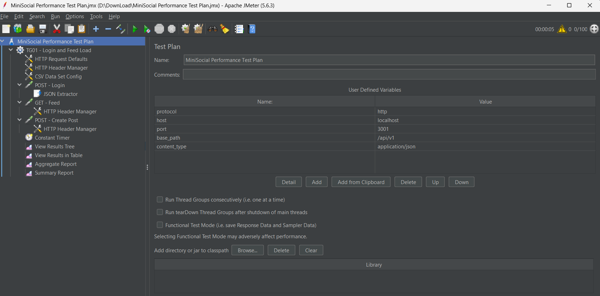
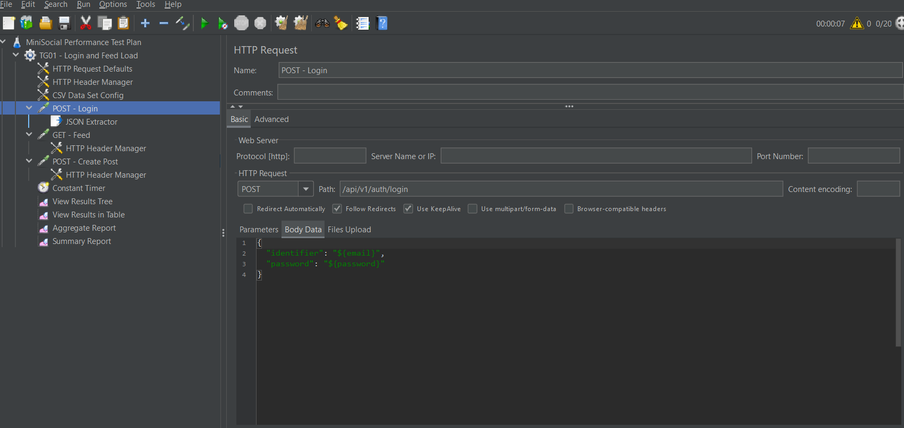
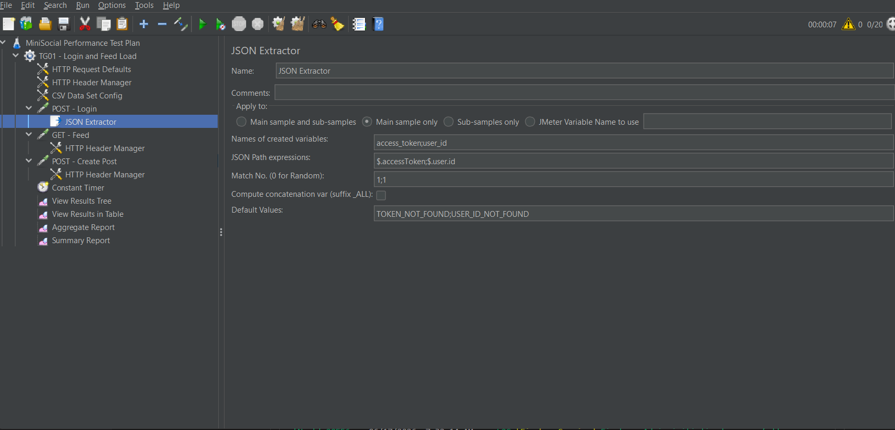
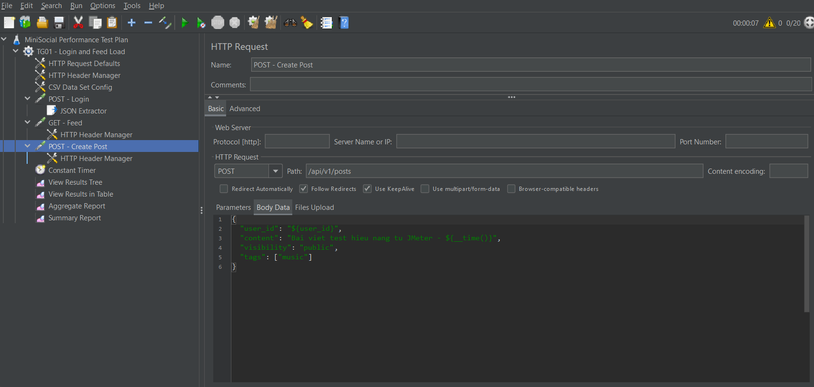
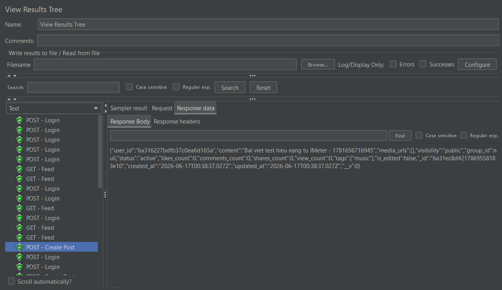
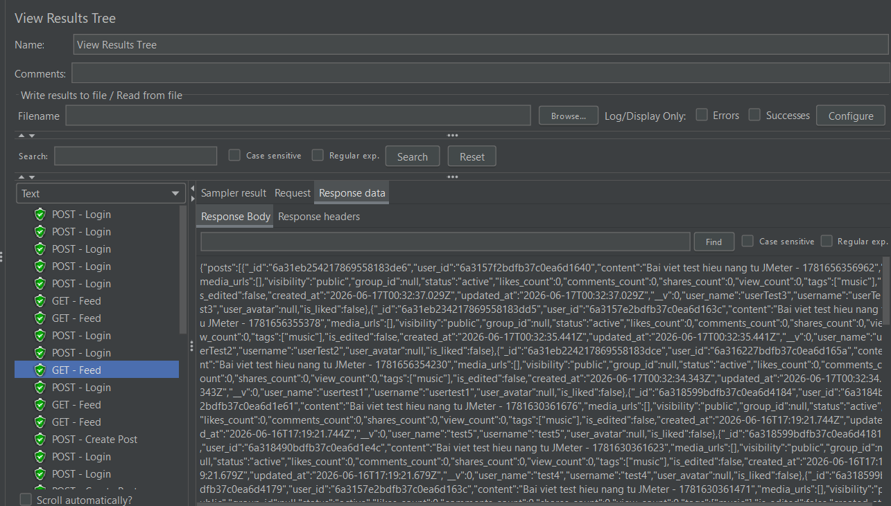
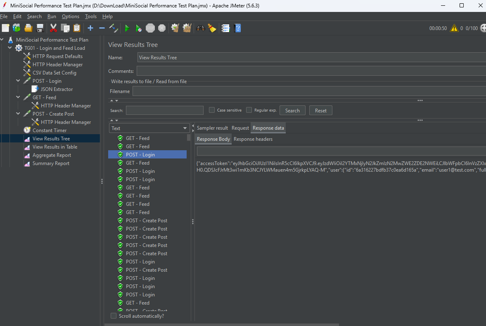
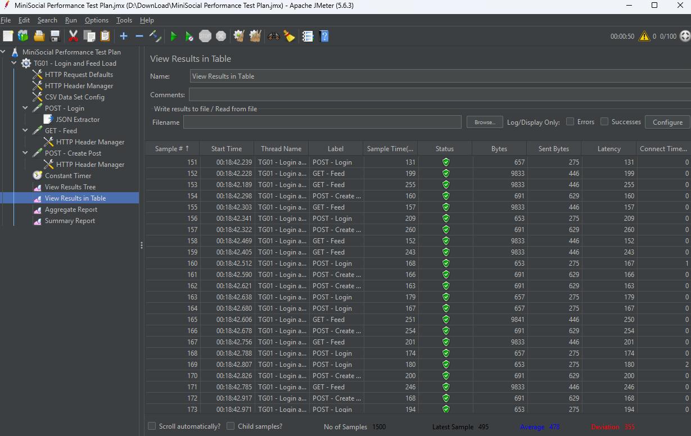
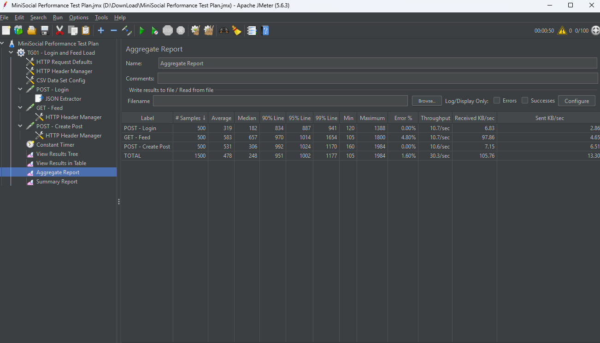
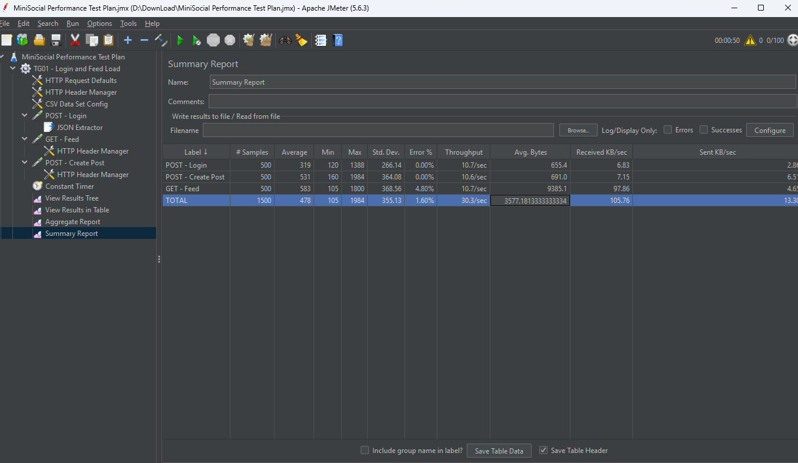

# Kiểm thử hiệu năng MiniSocial bằng Apache JMeter

## 1. Mục tiêu kiểm thử

Mục tiêu của phần kiểm thử hiệu năng là sử dụng **Apache JMeter** để mô phỏng nhiều người dùng truy cập đồng thời vào hệ thống MiniSocial, từ đó đánh giá khả năng phản hồi của backend khi xử lý các API chính.

Các nội dung được kiểm thử gồm:

- Đăng nhập người dùng và lấy token xác thực.
- Tạo bài viết mới.
- Lấy danh sách bài viết/newsfeed.
- Kiểm tra thời gian phản hồi của API.
- Kiểm tra số lượng request thành công/thất bại.
- Đánh giá khả năng xử lý khi tăng số lượng người dùng ảo.

Các chỉ số chính cần quan sát:

- Average response time.
- Min/Max response time.
- Throughput.
- Error rate.
- Trạng thái request trong View Results Tree.
- Tổng hợp kết quả trong Aggregate Report và Summary Report.

---

## 2. Công cụ sử dụng

Công cụ chính được sử dụng là **Apache JMeter**.

Apache JMeter là công cụ mã nguồn mở dùng để kiểm thử hiệu năng, kiểm thử tải và đánh giá khả năng chịu tải của hệ thống. Trong bài kiểm thử này, JMeter được dùng để gửi nhiều request đồng thời đến backend MiniSocial nhằm mô phỏng hành vi người dùng thật.

Các thành phần JMeter được sử dụng:

- Thread Group.
- HTTP Request.
- HTTP Header Manager.
- JSON Extractor.
- View Results Tree.
- Aggregate Report.
- Summary Report.
- View Results in Table.

---

## 3. Môi trường kiểm thử

Hệ thống kiểm thử: **MiniSocial**

Backend sử dụng API REST, trong đó các API kiểm thử chính gồm:

| Chức năng | Method | API |
|---|---:|---|
| Đăng nhập | POST | `/api/v1/auth/login` |
| Tạo bài viết | POST | `/api/v1/posts` |
| Lấy newsfeed | GET | `/api/v1/posts/feed` |

Mục tiêu là kiểm thử các API thường xuyên được sử dụng trong quá trình người dùng tương tác với mạng xã hội, đặc biệt là đăng nhập, tạo bài viết và xem feed.

---

## 4. Cấu trúc Test Plan

Test Plan trong JMeter được xây dựng gồm các request chính:

1. Đăng nhập tài khoản.
2. Trích xuất token từ response đăng nhập bằng JSON Extractor.
3. Gửi token vào các request cần xác thực.
4. Gọi API tạo bài viết.
5. Gọi API lấy feed.
6. Ghi nhận kết quả bằng các Listener.

Hình ảnh cấu trúc Test Plan:



---

## 5. Cấu hình kịch bản kiểm thử

### 5.1 Thread Group

Trong quá trình kiểm thử, nhóm đã thực hiện theo hai mức tải:

#### Lần chạy thử 1: tải nhỏ

- Số lượng user ảo: **5 users**
- Mục đích: kiểm tra kịch bản JMeter có hoạt động đúng không.
- Kết quả: các request chính có thể chạy được, phù hợp để kiểm tra ban đầu trước khi tăng tải.

#### Lần chạy thử 2: tải cao hơn

- Số lượng user ảo: **50 users**
- Sử dụng trong cùng một Thread Group.
- Mục đích: mô phỏng nhiều người dùng cùng đăng nhập, tạo bài viết và truy cập feed.
- Ghi nhận: ban đầu có một vài sample của API `GET /api/v1/posts/feed` bị lỗi, sau đó hệ thống chạy ổn định hơn.

---

## 6. Cấu hình request đăng nhập

Request đăng nhập được dùng để lấy token xác thực cho các API phía sau.

Thông tin request:

| Thành phần | Giá trị |
|---|---|
| Method | POST |
| API | `/api/v1/auth/login` |
| Body | Email và password của tài khoản test |
| Mục đích | Lấy access token |

Hình ảnh cấu hình request đăng nhập:



Sau khi đăng nhập thành công, response trả về token. Token này được lấy ra bằng **JSON Extractor** và lưu vào biến để dùng cho request tạo bài viết và lấy feed.

---

## 7. Cấu hình JSON Extractor

JSON Extractor được sử dụng để trích xuất `access_token` từ response của API login.

Mục đích:

* Lấy token tự động sau khi đăng nhập.
* Không cần copy token thủ công.
* Cho phép các request sau sử dụng token qua biến `${access_token}`.

Hình ảnh cấu hình JSON Extractor:



Token sau khi được extract sẽ được truyền vào Header:

```txt
Authorization: Bearer ${access_token}
```

---

## 8. Cấu hình request tạo bài viết

Request tạo bài viết dùng để kiểm tra API ghi dữ liệu vào hệ thống.

Thông tin request:

| Thành phần | Giá trị                                                    |
| ---------- | ---------------------------------------------------------- |
| Method     | POST                                                       |
| API        | `/api/v1/posts`                                            |
| Header     | Authorization Bearer Token                                 |
| Body       | Nội dung bài viết                                          |
| Mục đích   | Kiểm tra khả năng tạo post khi có nhiều user cùng thao tác |

Hình ảnh request tạo bài viết:



Hình ảnh cây kết quả request tạo bài viết:



Kết quả mong muốn:

* Request trả về trạng thái thành công.
* Bài viết được tạo trong hệ thống.
* Không phát sinh lỗi xác thực token.
* Backend xử lý được nhiều request tạo bài viết song song.

---

## 9. Cấu hình request lấy feed

Request lấy feed dùng để kiểm tra API đọc dữ liệu thường xuyên nhất trong hệ thống mạng xã hội.

Thông tin request:

| Thành phần | Giá trị                                           |
| ---------- | ------------------------------------------------- |
| Method     | GET                                               |
| API        | `/api/v1/posts/:id`                              |
| Header     | Authorization Bearer Token                        |
| Mục đích   | Kiểm tra khả năng tải danh sách bài viết/newsfeed |

Hình ảnh cây kết quả request lấy feed:



Trong lần chạy ban đầu với tải cao hơn, API lấy feed có xuất hiện một vài sample lỗi. Lỗi này cần được ghi nhận vì API feed là chức năng quan trọng, được gọi nhiều trong quá trình người dùng sử dụng ứng dụng.

Sau khi chạy lại hoặc sau khi hệ thống ổn định hơn, request feed hoạt động bình thường hơn.

---

## 10. Kết quả kiểm thử

### 10.1 View Results Tree

View Results Tree được dùng để kiểm tra chi tiết từng request, bao gồm:

* Request gửi đi.
* Response trả về.
* Status code.
* Response body.
* Thời gian phản hồi.
* Lỗi phát sinh nếu có.

Hình ảnh kết quả chi tiết:



---

### 10.2 View Results in Table

View Results in Table cho phép quan sát danh sách các sample đã chạy, thời gian phản hồi và trạng thái thành công/thất bại của từng request.

Hình ảnh bảng kết quả:



---

### 10.3 Aggregate Report

Aggregate Report dùng để tổng hợp các chỉ số hiệu năng của từng API.

Các chỉ số cần quan tâm:

* **Samples**: số lượng request đã gửi.
* **Average**: thời gian phản hồi trung bình.
* **Min/Max**: thời gian phản hồi nhỏ nhất/lớn nhất.
* **Error %**: tỷ lệ lỗi.
* **Throughput**: số request xử lý trong một đơn vị thời gian.

Hình ảnh Aggregate Report:



---

### 10.4 Summary Report

Summary Report cung cấp cái nhìn tổng quan về toàn bộ quá trình kiểm thử, bao gồm tổng số request, tỷ lệ lỗi, thời gian phản hồi trung bình và throughput của toàn bộ kịch bản.

Hình ảnh Summary Report:



---

## 11. Phân tích kết quả kiểm thử

Qua quá trình kiểm thử bằng JMeter, hệ thống MiniSocial đã xử lý được các request chính gồm đăng nhập, tạo bài viết và lấy feed.

Ở mức tải nhỏ với **5 user ảo**, kịch bản kiểm thử hoạt động ổn định. Các request có thể gửi thành công, token được trích xuất đúng bằng JSON Extractor và được truyền sang các request cần xác thực.

Khi tăng lên **50 user ảo trong một Thread Group**, hệ thống bắt đầu xuất hiện một số lỗi ở API lấy feed trong các sample đầu tiên. Đây là điểm cần chú ý vì feed là API có tần suất sử dụng cao trong hệ thống mạng xã hội. Tuy nhiên, sau giai đoạn đầu, các request tiếp theo chạy bình thường hơn, cho thấy backend vẫn có khả năng xử lý tải ở mức cơ bản.

Các kết quả từ Aggregate Report và Summary Report cho phép đánh giá:

* API login hoạt động đúng và trả về token.
* JSON Extractor lấy token thành công để truyền sang các request sau.
* API tạo bài viết hoạt động được khi có xác thực.
* API lấy feed có phát sinh lỗi ban đầu nhưng sau đó chạy ổn định hơn.
* Hệ thống có thể đáp ứng mức tải kiểm thử cơ bản, nhưng vẫn cần tối ưu thêm để giảm lỗi khi nhiều user truy cập đồng thời.

---

## 12. Lỗi ghi nhận trong quá trình kiểm thử

Trong quá trình chạy JMeter với tải cao hơn, API sau có xuất hiện lỗi ở một vài sample ban đầu:

```txt
GET /api/v1/posts/feed
```

Hiện tượng ghi nhận:

* Một số request lấy feed bị lỗi.
* Sau đó các request tiếp theo chạy bình thường hơn.

Nguyên nhân có thể liên quan đến:

* Thứ tự định nghĩa route trong backend chưa phù hợp.
* API `/posts/feed` có thể bị hiểu nhầm thành route động `/posts/:id`.
* Dữ liệu test hoặc trạng thái hệ thống chưa ổn định ở thời điểm bắt đầu chạy tải.
* Backend chưa xử lý tốt khi nhiều request truy cập đồng thời trong giai đoạn đầu.

Hướng xử lý đề xuất:

* Kiểm tra lại thứ tự khai báo route trong controller.
* Đảm bảo route `/feed` được đặt trước route `/:id`.
* Seed dữ liệu test đầy đủ trước khi chạy JMeter.
* Chạy thử với tải nhỏ trước khi tăng lên tải lớn.
* Theo dõi log backend trong quá trình chạy kiểm thử.

---

## 13. Kết luận

Kết quả kiểm thử hiệu năng bằng Apache JMeter cho thấy hệ thống MiniSocial có thể xử lý được các luồng API chính như đăng nhập, tạo bài viết và lấy feed ở mức tải cơ bản.

Với mức **5 user ảo**, hệ thống hoạt động ổn định, phù hợp cho kiểm thử ban đầu. Khi tăng lên **50 user ảo**, hệ thống vẫn xử lý được phần lớn request, tuy nhiên có xuất hiện một số lỗi ban đầu ở API lấy feed. Điều này cho thấy API feed cần được kiểm tra và tối ưu thêm vì đây là chức năng quan trọng trong hệ thống mạng xã hội.

Nhìn chung, MiniSocial đạt yêu cầu kiểm thử hiệu năng ở mức đồ án, nhưng để hệ thống ổn định hơn khi tăng tải, cần tiếp tục cải thiện:

* Xử lý route API rõ ràng hơn.
* Tối ưu truy vấn lấy feed.
* Bổ sung dữ liệu test ổn định.
* Theo dõi log backend và tài nguyên hệ thống khi chạy tải.
* Chạy lại kiểm thử sau khi sửa lỗi để đánh giá regression performance.

---
